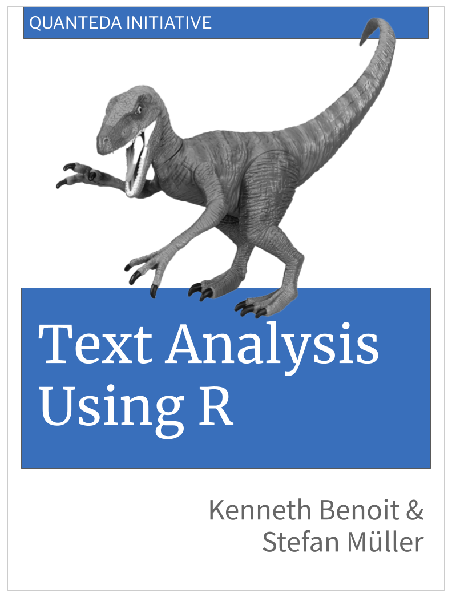

# Text Analysis Using R 

<!-- badges: start -->

[](https://github.com/quanteda/Text-Analysis-Using-R/actions/workflows/publish.yml)

<!-- badges: end -->

This is the source code of the book in progress, *Text Analysis Using R*, by Kenneth Benoit and Stefan Müller.

The draft HTML version of this book is published at https://quanteda.github.io/Text-Analysis-Using-R/. **However** we are not circulating this URL until we have a bit more content, at which stage we will also make the repository public.

## A companion R package

We have released a companion R package, TAUR, containing data and functions used in the book. You can install it using:

``` r
remotes::install_github("quanteda/TAUR")
```

## Providing feedback or contributing

This book is a work in progress and we welcome your feedback (sent through filing an [issue](https://github.com/quanteda/Text-Analysis-Using-R/issues)). You are even more welcome to edit the book yourself and submit the changes as a pull request. (Instructions for doing that can be found [here](https://gist.github.com/Chaser324/ce0505fbed06b947d962).) We are using the brilliant new [Quarto](https://quarto.org) framework for authoring this book. You can find full details as to how this works [here](https://quarto.org/docs/books/).

The *Text Analysis Using R* project is released with a [Contributor Code of Conduct](CODE_OF_CONDUCT.md). By participating in this project (for example, by submitting an [issue](https://github.com/quanteda/Text-Analysis-Using-R/issues) with suggestions or edits) you agree to abide by its terms. Instructions for making contributions can be found in the [`contributing.md`](contributing.md) file.
